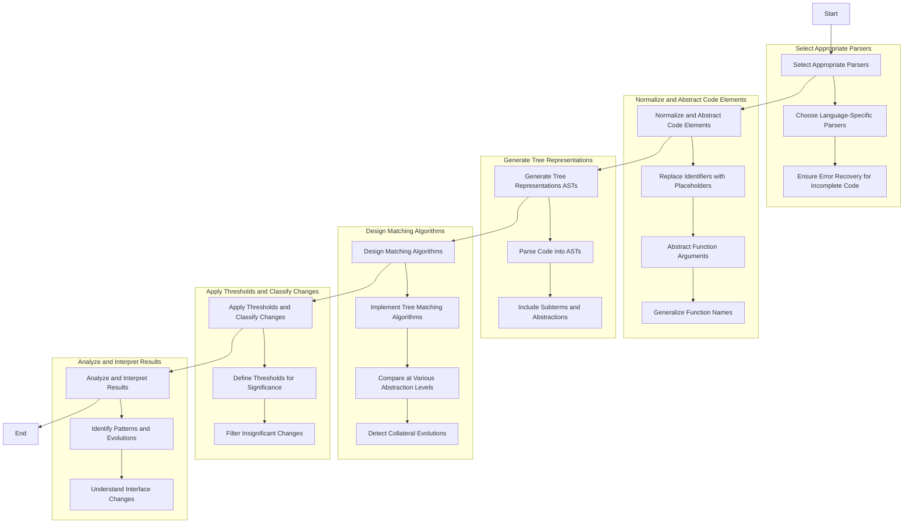

# Problem Statement

The goal is to parse incomplete code from C, C++, and Rust patch files into a data structure (such as an Abstract Syntax Tree) to analyze code changes and identify patterns across different code versions. This involves:

1. Handling incomplete code typical of patch files.
2. Normalizing and abstracting code elements to focus on structural changes rather than syntactic differences.
3. Constructing tree-based representations for code analysis.
4. Implementing matching algorithms to compare code fragments and detect patterns or collateral evolutions.
5. Dealing with multiple programming languages and their syntactic and semantic differences.

## Solution Overview

The following diagram outlines the steps to achieve this:

## Short Description of Steps

1. Select Appropriate Parsers: Use language-specific parsers for C, C++, and Rust that can handle incomplete code.

2. Normalize and Abstract Code Elements: Replace specific identifiers and literals with placeholders to focus on structural similarities.
   
3. Generate Tree Representations (ASTs): Parse the normalized code into Abstract Syntax Trees for analysis.

4. Design Matching Algorithms: Implement algorithms to compare ASTs and detect patterns across code versions.

5. Apply Thresholds and Classify Changes: Define thresholds to filter out insignificant changes and focus on meaningful evolutions.

6. Analyze and Interpret Results: Identify recurring patterns and understand changes affecting interfaces or APIs.
